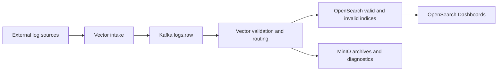

# Observability Ingestion Platform

A local, Docker Compose based observability pipeline for evaluating log intake, buffering, validation, search, retention and archival. External sources send events over HTTP JSON, TCP JSON lines, syslog or mounted file-tail inputs. Kafka buffers intake; Vector validates, normalises and routes events; OpenSearch indexes valid and invalid records; MinIO-compatible storage keeps archives and large diagnostics.

This is an integration and operational evaluation environment. It is not presented as a production deployment. The repository includes dashboards, retention configuration, diagnostics, stress tooling and deployment guidance. It is licensed under AGPL-3.0.

## Architecture



The intake and processing stages are separated by Kafka so short downstream interruptions do not immediately stop acceptance. Valid and invalid events have distinct search and archive paths. Large diagnostic payloads are stored as objects; searchable events retain references and size metadata rather than embedding those payloads in OpenSearch.

## Design Decisions and Trade-offs

- **Kafka between intake and sinks:** supports buffering and replay during downstream recovery, with local topic retention and partition settings documented in the configuration. It also adds another service to operate.
- **Vector for processing:** one component handles source intake, schema checks, normalisation and routing. Pipeline changes need validation against both valid and invalid paths.
- **OpenSearch for investigation:** searchable indices and bundled dashboards support trace, service, connector and error queries. Search retention is finite and configured separately from archives.
- **Object storage for archives and diagnostics:** keeps large payloads out of the search index. MinIO is a local stand-in; durable remote storage, access control and lifecycle policy need environment-specific design.
- **Explicit local boundary:** Compose defaults and localhost endpoints support development only. They are not a secure production configuration.

## Run Locally

Copy the example configuration, review every local value, then start and exercise the stack:

```bash
cp .env.example .env
./scripts/up.sh
./scripts/test-pipeline.sh
```

The test script covers HTTP, TCP, syslog and file-tail intake, invalid-event routing, diagnostic storage, search and archive paths. Useful checks include `docker compose config`, shell syntax validation, retention setup and dashboard provisioning. See [docs/02-setup.md](docs/02-setup.md) and [docs/10-troubleshooting.md](docs/10-troubleshooting.md).

## Operations and Security

Local defaults are for development. Before connecting external systems, define trusted sources, authentication, TLS termination, payload and rate limits, firewall rules, retention, storage durability, monitoring and incident ownership. Keep OpenSearch, Dashboards, Kafka and object storage private. Replace local credentials and tokens; never reuse them in a shared environment.

The documentation covers [intake contracts](docs/04-logging-contract-and-fields.md), [security and firewall controls](docs/06-security-firewall-and-intake.md), [retention and diagnostics](docs/07-retention-storage-and-diagnostics.md), [stress testing](docs/08-stress-testing.md), [production considerations](docs/09-production-notes.md) and [design decisions](docs/11-decision-log.md).
